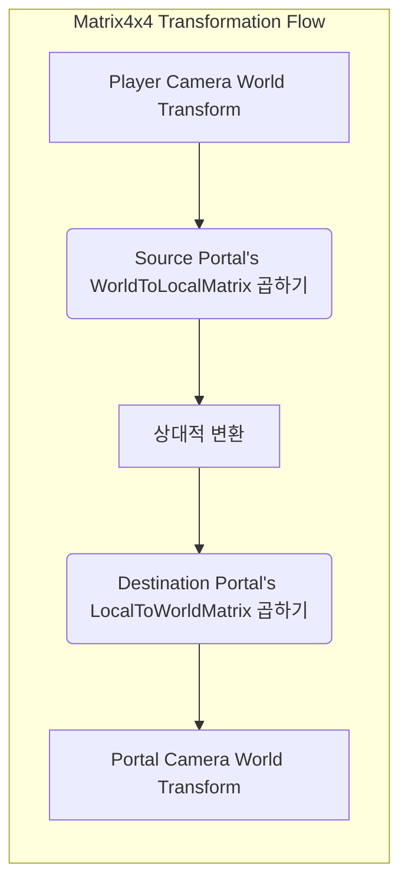
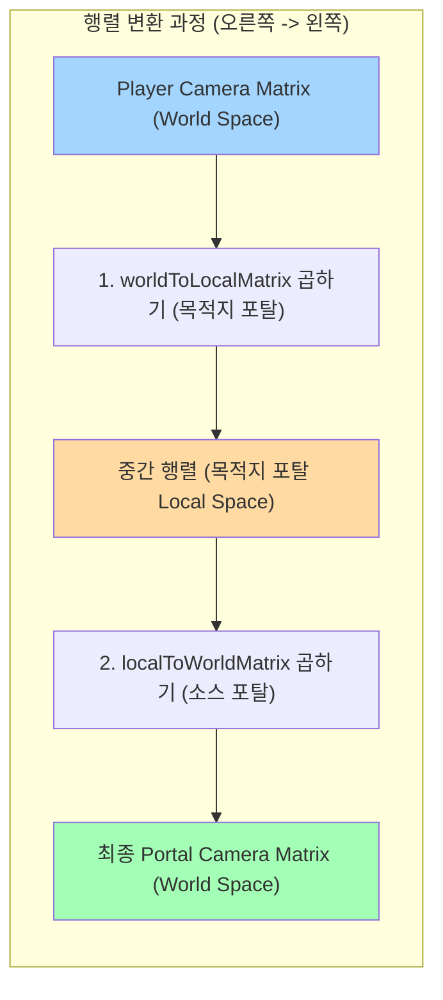

### Matrix4x4 변환 과정 설명

위 다이어그램은 포탈 뷰를 렌더링하는 `Portal Camera`의 최종 월드 변환(위치와 회전)을 계산하는 과정을 보여줍니다.

1.  **[Player Camera World Transform]**: 플레이어 카메라의 현재 월드 공간에서의 위치와 회전 정보입니다.

2.  **[Source Portal's WorldToLocalMatrix 곱하기]**: 플레이어 카메라의 월드 변환에 **소스 포탈(보고 있는 포탈)**의 `WorldToLocalMatrix`를 곱합니다.
    *   **결과**: 플레이어 카메라가 소스 포탈을 기준으로 얼마나 떨어져 있고 어떻게 회전해 있는지를 나타내는 **상대적인(Relative) 변환**이 계산됩니다.

3.  **[Destination Portal's LocalToWorldMatrix 곱하기]**: 위에서 계산된 상대적인 변환에 **목적지 포탈(연결된 포탈)**의 `LocalToWorldMatrix`를 곱합니다.
    *   **결과**: "만약 플레이어가 목적지 포탈에 대해 동일한 상대적 위치에 있다면 어디에 있을까?"를 계산하여, `Portal Camera`가 위치해야 할 최종 **월드 공간 변환**을 얻게 됩니다.

이러한 행렬 연산을 통해, 플레이어가 움직이고 회전할 때마다 포탈을 통해 보이는 뷰가 마치 실제 다른 공간을 보는 것처럼 완벽하게 동기화될 수 있습니다.

---

### 계산 과정에서의 행렬 변화



### 행렬의 변화 단계별 해설

위 다이어그램은 하나의 행렬(플레이어 카메라의 월드 행렬)이 두 번의 곱셈을 거치면서 **기준이 되는 좌표 공간**이 어떻게 변하는지를 보여줍니다.

#### **시작: Player Camera Matrix (World Space)**

*   **상태**: 모든 게임 오브젝트가 공유하는 절대적인 기준인 **월드 공간(World Space)**을 기준으로 플레이어 카메라의 위치와 회전을 나타냅니다.

---

#### **1단계: 목적지 포탈의 `worldToLocalMatrix` 곱하기**

*   **무슨 일?**: 월드 공간에 있던 플레이어 카메라의 정보를 **목적지 포탈(Destination Portal)의 지역 공간(Local Space)**으로 변환합니다.
*   **결과 (중간 행렬)**: 이제 행렬의 정보는 더 이상 월드 기준이 아닙니다. **"플레이어 카메라는 목적지 포탈로부터 얼마나 떨어져 있는가?"**를 나타내는 **상대적인 값**이 됩니다.
    *   예: "목적지 포탈의 정면(z축)으로 5, 오른쪽(x축)으로 1만큼 떨어진 위치"와 같은 정보가 담깁니다.

---

#### **2단계: 소스 포탈의 `localToWorldMatrix` 곱하기**

*   **무슨 일?**: 1단계에서 얻은 **상대적인 값**을 이번에는 **소스 포탈(Source Portal)의 지역 공간(Local Space)**에 적용합니다. 그리고 그 결과를 다시 **월드 공간(World Space)**으로 변환합니다.
*   **결과 (최종 행렬)**: **포탈 카메라(Portal Camera)가 있어야 할 최종 월드 위치와 회전**이 계산됩니다.
    *   예: "소스 포탈의 정면(z축)으로 5, 오른쪽(x축)으로 1만큼 떨어진 **월드 좌표**"가 계산되어, 포탈 카메라가 그 위치로 이동하게 됩니다.

결론적으로 이 연산은 **`플레이어 카메라` -> `월드 공간` -> `목적지 포탈 로컬 공간` -> (값 복사) -> `소스 포탈 로컬 공간` -> `월드 공간` -> `포탈 카메라`** 순서로 좌표를 변환하여 완벽한 포탈 뷰를 만들어내는 과정입니다.

---
### 실제 값 예시: 4x4 행렬 변환 다이어그램

```mermaid
graph LR
    title "4x4 Matrix Transformation with Example Values"

    subgraph "Step 1: PlayerCam World Matrix"
        A["
            PlayerCam World Matrix
            --------------------
            | 1  0  0   5 |
            | 0  1  0   2 |
            | 0  0  1  10 |
            | 0  0  0   1 |
            --------------------
            World Pos: (5, 2, 10)
        "]
    end

    subgraph "Step 2: Multiply by Dest_WorldToLocal"
        Op1["
            X
            Dest_WorldToLocal
            --------------------
            | 1  0  0   0 |
            | 0  1  0   0 |
            | 0  0  1 -20 |
            | 0  0  0   1 |
        "]
    end

    subgraph "Step 3: Intermediate Matrix"
        B["
            Intermediate Matrix
            --------------------
            | 1  0  0   5 |
            | 0  1  0   2 |
            | 0  0  1 -10 |
            | 0  0  0   1 |
            --------------------
            Relative Pos: (5, 2, -10)
        "]
    end

    subgraph "Step 4: Multiply by Source_LocalToWorld"
        Op2["
            X
            Source_LocalToWorld
            --------------------
            |-1  0  0  30 |
            | 0  1  0   0 |
            | 0  0 -1   0 |
            | 0  0  0   1 |
        "]
    end

    subgraph "Step 5: Final PortalCam Matrix"
        C["
            Final PortalCam Matrix
            --------------------
            |-1  0  0  25 |
            | 0  1  0   2 |
            | 0  0 -1  10 |
            | 0  0  0   1 |
            --------------------
            World Pos: (25, 2, 10)
            Rotation: Y-axis 180 deg
        "]
    end

    A --> Op1 --> B --> Op2 --> C

    style A fill:#A3D5FF,stroke:#333
    style B fill:#FFDBA3,stroke:#333
    style C fill:#A3FFB5,stroke:#333
```

#### 상황 설정

*   **플레이어 카메라 위치**: `(5, 2, 10)`
*   **목적지 포탈 위치**: `(0, 0, 20)` (회전 없음)
*   **소스 포탈 위치**: `(30, 0, 0)` (**Y축으로 180도 회전**하여 반대편을 바라봄)