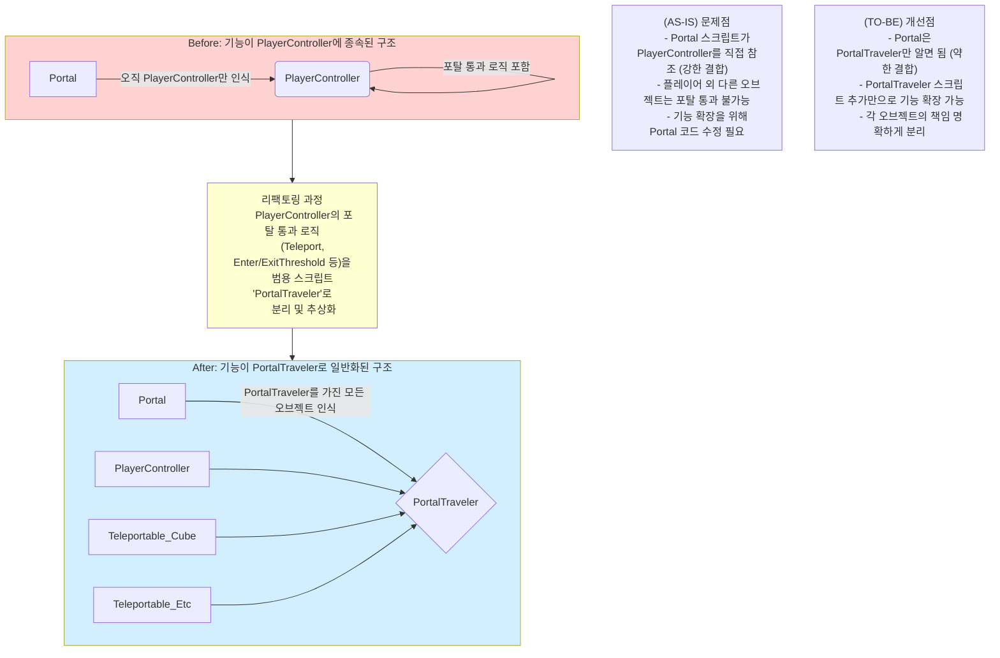

### 리팩토링 과정 설명

#### **Before (AS-IS)**

*   **구조**: `Portal` 스크립트는 `PlayerController`라는 특정 클래스를 직접 알고 있어야 했습니다. 포탈을 통과하는 모든 로직(위치 계산, 텔레포트 등)이 `PlayerController` 내부에 구현되어 있었습니다.
*   **문제점**:
    1.  **강한 결합**: `Portal`이 `PlayerController`에 너무 의존적이어서, 둘 중 하나를 수정하면 다른 쪽도 영향을 받을 가능성이 컸습니다.
    2.  **확장성 부족**: 만약 '큐브'나 다른 NPC도 포탈을 통과하게 만들고 싶다면, `Portal` 스크립트에 '큐브'를 인식하는 코드를 또 추가해야 했습니다. 기능이 추가될 때마다 `Portal` 코드가 계속 복잡해지는 구조였습니다.

#### **After (TO-BE)**

*   **구조**:
    1.  `PlayerController`에 있던 포탈 통과 관련 핵심 로직을 **`PortalTraveler`** 라는 새로운 스크립트로 완전히 분리했습니다.
    2.  이제 `Portal`은 `PlayerController`나 `Cube` 같은 구체적인 클래스는 전혀 알 필요가 없어졌습니다. 대신 **"누군가 `PortalTraveler` 스크립트를 가지고 있다면, 그 오브젝트는 포탈을 통과할 수 있다"**는 사실만 알게 되었습니다.
    3.  `PlayerController`는 이제 `PortalTraveler`를 상속받거나 컴포넌트로 포함하여, 포탈 통과 '능력'을 갖게 됩니다.
    4.  새로운 `Teleportable_Cube`나 다른 어떤 오브젝트든, `PortalTraveler` 스크립트를 추가하기만 하면 즉시 포탈을 통과할 수 있게 되었습니다.

*   **개선점**:
    1.  **약한 결합**: `Portal`은 추상적인 '능력'(`PortalTraveler`)에만 의존하므로, 새로운 오브젝트가 추가되어도 `Portal` 코드는 전혀 수정할 필요가 없습니다.
    2.  **뛰어난 확장성**: 새로운 오브젝트를 포탈 통과 가능하게 만드는 작업이 스크립트 하나를 추가하는 것으로 매우 간단해졌습니다.
    3.  **관심사의 분리**: `PlayerController`는 플레이어의 조작에만 집중하고, `PortalTraveler`는 포탈을 통과하는 것에만 집중하여 코드의 역할이 명확해졌습니다.