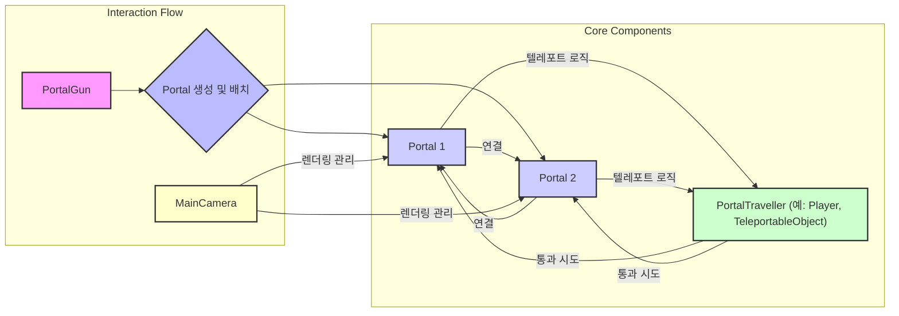

### 포탈 시스템 구조 (간소화)

이 다이어그램은 포탈 시스템의 핵심 흐름과 주요 구성 요소를 간결하게 보여줍니다.

1.  **PortalGun**: 플레이어가 포탈을 발사하는 도구입니다. 두 개의 `Portal` 객체를 생성하고 게임 월드에 배치합니다.

2.  **Portal (포탈 1, 포탈 2)**: 서로 연결되어 있는 두 개의 포탈입니다. 한 포탈로 들어가면 연결된 다른 포탈로 나오게 됩니다.

3.  **PortalTraveller (예: Player, TeleportableObject)**: 포탈을 통과할 수 있는 모든 객체(플레이어, 움직이는 물체 등)를 나타냅니다. 이 객체들이 포탈에 닿으면 텔레포트 로직이 발동됩니다.

4.  **MainCamera**: 씬에 있는 모든 포탈의 시각적인 렌더링을 관리합니다. 플레이어의 시점에서 포탈 너머의 장면이 자연스럽게 보이도록 처리합니다.

### 핵심 상호작용

*   **생성**: `PortalGun`이 두 개의 `Portal`을 만들고 서로 연결합니다.
*   **이동**: `PortalTraveller`가 `Portal`에 진입하면, `Portal`은 `PortalTraveller`를 연결된 다른 `Portal`의 위치로 텔레포트시킵니다.
*   **시각화**: `MainCamera`는 모든 `Portal`의 렌더링을 조율하여 포탈 너머의 세계를 보여줍니다.