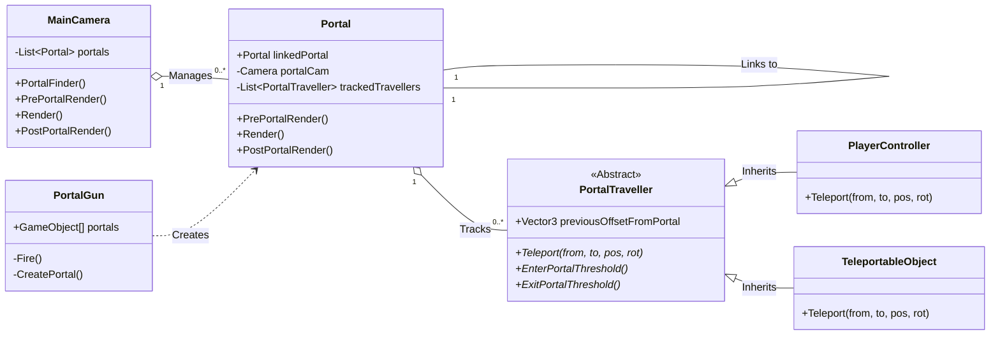

### 주요 클래스 구조 설명

위 다이어그램은 포탈 시스템을 구성하는 핵심 클래스들의 구조와 관계를 보여줍니다.

1.  **`PortalTraveller` (추상 클래스)**
    *   포탈을 통과할 수 있는 모든 객체의 **부모 클래스**입니다.
    *   텔레포트에 필요한 기본 기능들(`Teleport`, `EnterPortalThreshold` 등)을 정의합니다. `*` 표시는 추상 메서드를 의미하며, 자식 클래스에서 반드시 구현해야 함을 나타냅니다.

2.  **`PlayerController` & `TeleportableObject`**
    *   `PortalTraveller`를 **상속**받는 클래스들입니다.
    *   이 클래스들은 플레이어나 텔레포트 가능한 물체처럼, 실제로 포탈을 통과하는 객체들입니다.
    *   각자의 특성에 맞게 `Teleport` 메서드를 재정의(Override)하여 사용합니다.

3.  **`Portal`**
    *   포탈 자체의 로직을 담당합니다.
    *   자신과 연결될 다른 `Portal` 객체(`linkedPortal`)를 참조합니다.
    *   자신의 영역에 들어온 `PortalTraveller` 객체들을 추적하고 관리합니다.

4.  **`PortalGun`**
    *   `Portal` 객체를 생성(`Creates`)하는 역할을 합니다. `Fire()` 메서드를 통해 포탈을 발사하고 배치합니다.

5.  **`MainCamera`**
    *   씬에 있는 모든 `Portal` 객체들을 관리(`Manages`)합니다.
    *   각 포탈의 렌더링 순서를 제어하여 포탈 너머의 뷰가 올바르게 보이도록 합니다.