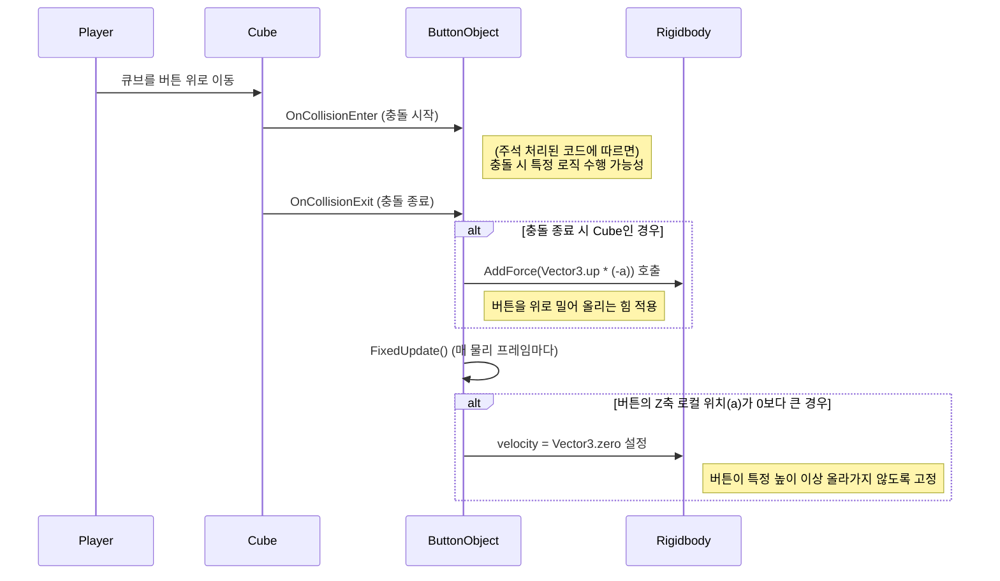

```mermaid
sequenceDiagram
    participant Player
    participant Cube
    participant ButtonObject
    participant Rigidbody

    Player->>Cube: 큐브를 버튼 위로 이동
    Cube->>ButtonObject: OnCollisionEnter (충돌 시작)
    Note right of ButtonObject: (주석 처리된 코드에 따르면)<br/>충돌 시 특정 로직 수행 가능성
    Cube->>ButtonObject: OnCollisionExit (충돌 종료)
    alt 충돌 종료 시 Cube인 경우
        ButtonObject->>Rigidbody: AddForce(Vector3.up * (-a)) 호출
        Note left of Rigidbody: 버튼을 위로 밀어 올리는 힘 적용
    end
    ButtonObject->>ButtonObject: FixedUpdate() (매 물리 프레임마다)
    alt 버튼의 Z축 로컬 위치(a)가 0보다 큰 경우
        ButtonObject->>Rigidbody: velocity = Vector3.zero 설정
        Note right of Rigidbody: 버튼이 특정 높이 이상 올라가지 않도록 고정
    end
```