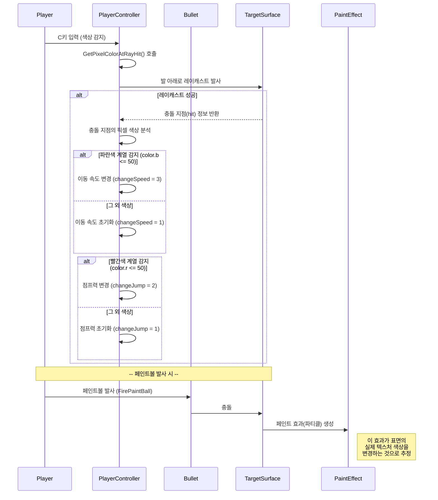

```mermaid
sequenceDiagram
    participant Player
    participant PlayerController
    participant Bullet
    participant TargetSurface
    participant PaintEffect

    Player->>PlayerController: C키 입력 (색상 감지)
    PlayerController->>PlayerController: GetPixelColorAtRayHit() 호출
    PlayerController->>TargetSurface: 발 아래로 레이캐스트 발사
    alt 레이캐스트 성공
        TargetSurface-->>PlayerController: 충돌 지점(hit) 정보 반환
        PlayerController->>PlayerController: 충돌 지점의 픽셀 색상 분석
        alt 파란색 계열 감지 (color.b <= 50)
            PlayerController->>PlayerController: 이동 속도 변경 (changeSpeed = 3)
        else 그 외 색상
            PlayerController->>PlayerController: 이동 속도 초기화 (changeSpeed = 1)
        end
        alt 빨간색 계열 감지 (color.r <= 50)
            PlayerController->>PlayerController: 점프력 변경 (changeJump = 2)
        else 그 외 색상
            PlayerController->>PlayerController: 점프력 초기화 (changeJump = 1)
        end
    end

    %% 페인트볼 발사 및 표면 색상 변경 (참고)
    Note over Player, TargetSurface: -- 페인트볼 발사 시 --
    Player->>Bullet: 페인트볼 발사 (FirePaintBall)
    Bullet->>TargetSurface: 충돌
    TargetSurface->>PaintEffect: 페인트 효과(파티클) 생성
    Note right of PaintEffect: 이 효과가 표면의<br/>실제 텍스처 색상을<br/>변경하는 것으로 추정
```